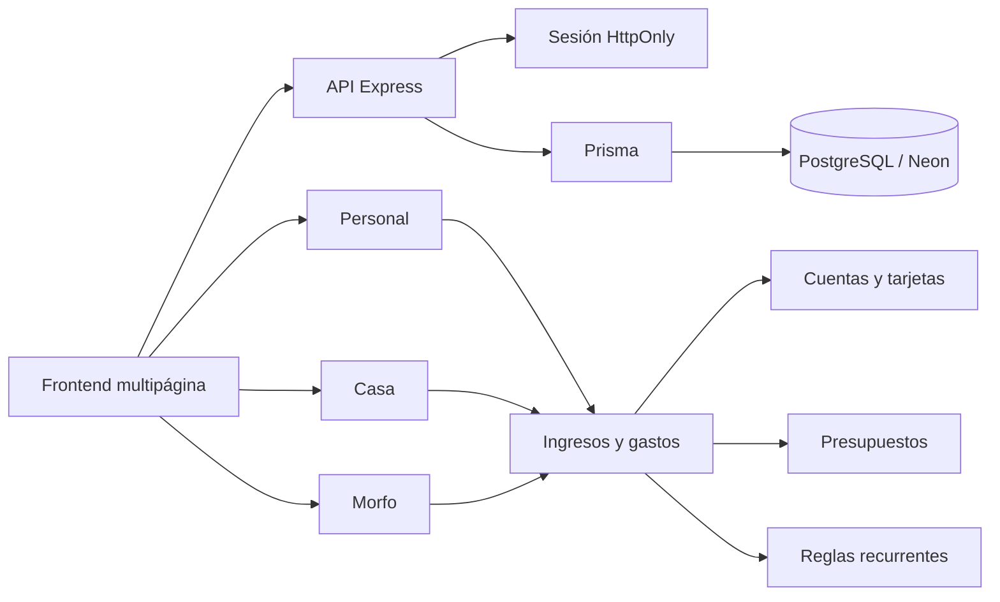

# Arquitectura funcional de Morfo Hub

Morfo Hub es un solo software con tres espacios financieros independientes.

## Espacios

### Personal

- Movimientos privados por usuario.
- Cuentas, tarjetas, presupuesto y fuentes de ingreso personales.
- Análisis de gasto mensual y por categoría.

### Casa

- Ingresos y gastos compartidos.
- Reglas de quincena y compromisos del hogar.
- Seguimiento del dinero disponible entre periodos de pago.

### Morfo

- Flujo de efectivo de la agencia.
- Clientes, cotizaciones, cobros y gastos.
- Cuentas por cobrar y lectura comercial.

## Flujo de datos

## Reglas del dominio

- Un movimiento pertenece a un solo espacio.
- Un movimiento puede asociarse a una cuenta o tarjeta.
- Los ingresos pendientes no aumentan el saldo hasta recibirse.
- Una regla recurrente es una expectativa, no un movimiento realizado.
- El día de corte y el día de pago de una tarjeta son campos distintos.
- Personal requiere propietario; Casa y Morfo son compartidos.
- Los registros heredados sin espacio explícito se consideran Morfo.
