# Arquitectura funcional propuesta

Este documento resume una arquitectura objetivo para evolucionar Morfo Hub
desde el frontend multipagina actual hacia una solucion con backend, servicios
de negocio y persistencia estructurada.

## Vista general por capas

```mermaid
flowchart TB

subgraph CAPA1["Capa de Presentacion"]
    UI1["Portal Cliente<br/>HTML / CSS / JavaScript"]
    UI2["Panel Empleado / Vendedor<br/>HTML / CSS / JavaScript"]
    UI3["Panel Administrador<br/>HTML / CSS / JavaScript"]
end

subgraph CAPA2["Capa de Controladores"]
    C1["ClienteController<br/>- registro de cliente<br/>- gestion de perfil<br/>- direcciones de envio"]
    C2["EmpleadoController<br/>- gestion de empleados<br/>- asignacion de roles<br/>- control de privilegios"]
    C3["InventarioController<br/>- consulta de inventario<br/>- filtros por tipo, marca y precio<br/>- actualizacion de stock"]
    C4["PedidoController<br/>- carrito de compras<br/>- creacion de pedidos<br/>- detalle de pedido"]
    C5["FacturaController<br/>- generacion de facturas<br/>- consulta de facturas"]
    C6["PagoController<br/>- registro de pagos<br/>- validacion de transacciones"]
    C7["EnvioController<br/>- solicitud de envio<br/>- calculo de opciones<br/>- seguimiento de envio"]
    C8["ReporteController<br/>- seguimiento de ventas<br/>- reportes por periodo<br/>- metricas por producto"]
    C9["ProveedorController<br/>- compras a proveedor<br/>- abastecimiento<br/>- seguimiento de ordenes"]
end

subgraph CAPA3["Capa de Servicios / Logica de Negocio"]
    S1["Modulo Cliente"]
    S2["Modulo Empleado y Seguridad"]
    S3["Modulo Catalogo"]
    S4["Modulo Inventario"]
    S5["Modulo Pedido"]
    S6["Modulo Facturacion"]
    S7["Modulo Pago"]
    S8["Modulo Envio"]
    S9["Modulo Reportes"]
    S10["Modulo Proveedores"]
end

subgraph CAPA4["Capa de Modelo de Datos"]
    M1["Cliente"]
    M2["Empleado"]
    M3["Rol"]
    M4["Permiso"]
    M5["Producto"]
    M6["CategoriaProducto"]
    M7["Inventario"]
    M8["Pedido"]
    M9["DetallePedido"]
    M10["Factura"]
    M11["Pago"]
    M12["Envio"]
    M13["Proveedor"]
    M14["CompraProveedor"]
    M16["DireccionEnvio"]
end

subgraph CAPA5["Capa de Persistencia"]
    R1["ClienteRepository"]
    R2["EmpleadoRepository"]
    R3["ProductoRepository"]
    R4["InventarioRepository"]
    R5["PedidoRepository"]
    R6["FacturaRepository"]
    R7["PagoRepository"]
    R8["EnvioRepository"]
    R9["ProveedorRepository"]
end

subgraph TEC["Lenguajes y Tecnologias"]
    T1["Backend: Java + Spring Boot"]
    T2["Frontend: HTML + CSS + JavaScript"]
    T3["API: REST + JSON"]
    T4["Persistencia: JPA / Hibernate"]
    T5["Base de datos: PostgreSQL"]
    T6["Seguridad: Spring Security + RBAC"]
end

UI1 --> C1
UI1 --> C4
UI1 --> C6
UI1 --> C7

UI2 --> C3
UI2 --> C4
UI2 --> C7

UI3 --> C2
UI3 --> C5
UI3 --> C8
UI3 --> C9

C1 --> S1
C2 --> S2
C3 --> S4
C4 --> S5
C5 --> S6
C6 --> S7
C7 --> S8
C8 --> S9
C9 --> S10

S5 --> S1
S5 --> S4
S5 --> S6
S5 --> S7
S5 --> S8
S10 --> S4
S9 --> S5

S1 --> M1
S1 --> M16
S2 --> M2
S2 --> M3
S2 --> M4
S3 --> M5
S3 --> M6
S4 --> M7
S4 --> M5
S5 --> M8
S5 --> M9
S6 --> M10
S7 --> M11
S8 --> M12
S10 --> M13
S10 --> M14

M1 --> R1
M2 --> R2
M5 --> R3
M7 --> R4
M8 --> R5
M10 --> R6
M11 --> R7
M12 --> R8
M13 --> R9

R1 --> T5
R2 --> T5
R3 --> T5
R4 --> T5
R5 --> T5
R6 --> T5
R7 --> T5
R8 --> T5
R9 --> T5

T1 --> C1
T1 --> C2
T1 --> C3
T1 --> C4
T1 --> C5
T1 --> C6
T1 --> C7
T1 --> C8
T1 --> C9

T2 --> UI1
T2 --> UI2
T2 --> UI3
T3 --> C1
T3 --> C2
T3 --> C3
T3 --> C4
T3 --> C5
T3 --> C6
T3 --> C7
T3 --> C8
T3 --> C9
T4 --> R1
T4 --> R2
T4 --> R3
T4 --> R4
T4 --> R5
T4 --> R6
T4 --> R7
T4 --> R8
T4 --> R9
T6 --> C2
```

## Lectura del modelo

- La capa de presentacion separa tres experiencias: cliente, empleado y
  administrador.
- Los controladores exponen endpoints REST especializados por dominio.
- La capa de servicios concentra reglas de negocio y orquestacion entre
  modulos.
- El modelo de datos refleja las entidades principales del negocio.
- La persistencia encapsula el acceso a PostgreSQL mediante JPA/Hibernate.

## Ajuste con el estado actual del repositorio

Hoy este repositorio contiene principalmente la capa de presentacion en
`HTML + CSS + JavaScript`, con integraciones puntuales en Firebase para login y
clientes. Por eso este diagrama debe leerse como una arquitectura objetivo de
mediano plazo, no como una representacion exacta del codigo existente.

## Orden de implementacion sugerido

1. Definir el dominio base: clientes, productos, inventario y pedidos.
2. Crear API REST y controladores del backend en Spring Boot.
3. Modelar entidades JPA y repositorios sobre PostgreSQL.
4. Incorporar seguridad con Spring Security y RBAC.
5. Migrar gradualmente el frontend actual para consumir la nueva API.
